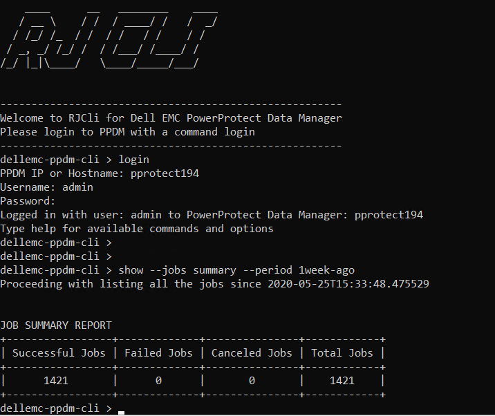
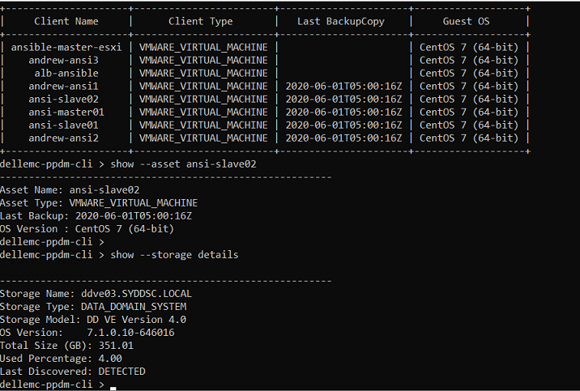

# rjcli for Dell EMC PowerProtect Data Manager

A command line interface developed for Dell EMC Power Protect Data Manager (PPDM). PPDM is a Dell EMC's modern data center backup and recovery software which is developed based on microservices architecture.
It has a user friendly and modern interface to configure, manage and monitor backups. PPDM has a RestAPI for the customers to integrate backups into their DevOps pipeline or for other automation purpose.
I have developed this CLI to provide some of the funcitionalies through a command line for the customers who wish to use CLI.

This CLI has features like to list activities, storage, policies, assets and also will be able to retry failed jobs.
This is a version 1.0 CLI, i will be adding more features in the future.

## Getting Started

**Windows and Linux using Python3 and Pip.**

rjcli package is available in Python Package Index (PyPi) or download the sourcecode from this repo and install it using setup.py

Python >3.5 and pip are prerequesites, please install them before installing this package.

```
pip install rjcli
```

OR

**If you do not want to install Python and want an executable binary, then download the executable from Windows folder.**

```
Download rjcli.zip and unzip
Execute rjcli.exe
```
Once installed execute a command 'rjcli' and login to PPDM!


## Usage
Connect to the PPDM with either hostname or IP. The following are the commands and options available.

```
login

show --help
show --<option> --help

show --jobs summary --period <1day-ago | 1week-ago>
show --jobs successful --period <1day-ago | 1week-ago>
show --jobs failed --period <1day-ago | 1week-ago>
show --jobs all --period <1day-ago | 1week-ago>
show --storage details
show --asset all
show --asset <key-word>
show --policies all
show --policies <key-word>

backup --client <name>
backup --retry ALL-FAILED --period <1day-ago | 1week-ago>

monitor --activityid <activity-id>
monitor --jobs running
```

## Example Output


```
dellemc-ppdm-cli > show --jobs successful --period 1day-ago
+---------------+-----------+------------+--------------------------+
| Activity Name | Job Type  | Job Status |        Start Time        |
+---------------+-----------+------------+--------------------------+
|  PLC1-VMware  |    JOB    |     OK     | 2020-06-01T07:00:00.885Z |
|  PLC1-VMware  |    JOB    |     OK     | 2020-06-01T07:00:00.772Z |
|  PLC1-VMware  |    JOB    |     OK     | 2020-06-01T07:00:00.661Z |
| PLC-VMware-2  |    JOB    |     OK     | 2020-06-01T07:00:00.628Z |
|  PLC1-VMware  |    JOB    |     OK     | 2020-06-01T07:00:00.513Z |
| PLC-VMware-2  |    JOB    |     OK     | 2020-06-01T07:00:00.465Z |
| PLC-VMware-2  | JOB_GROUP |     OK     | 2020-06-01T07:00:00.429Z |
|  PLC1-VMware  |    JOB    |     OK     | 2020-06-01T07:00:00.383Z |
|  PLC1-VMware  | JOB_GROUP |     OK     | 2020-06-01T07:00:00.344Z |
|  PLC1-VMware  |    JOB    |     OK     | 2020-06-01T06:00:01.070Z |
|  PLC1-VMware  |    JOB    |     OK     | 2020-06-01T06:00:00.891Z |
|  PLC1-VMware  |    JOB    |     OK     | 2020-06-01T06:00:00.775Z |
|  PLC1-VMware  |    JOB    |     OK     | 2020-06-01T06:00:00.629Z |
| PLC-VMware-2  |    JOB    |     OK     | 2020-06-01T06:00:00.560Z |
|  PLC1-VMware  |    JOB    |     OK     | 2020-06-01T06:00:00.448Z |


dellemc-ppdm-cli > show --policies all
+--------------+------------------------+--------+-----------+----------------------+
| Policy Name  |      Policy Type       | Status | Frequency |    Next Schedule     |
+--------------+------------------------+--------+-----------+----------------------+
| PLC1-VMware  | VMWARE_VIRTUAL_MACHINE | ACTIVE |  HOURLY   | 2020-05-06T10:00:00Z |
| PLC-VMware-2 | VMWARE_VIRTUAL_MACHINE | ACTIVE |  HOURLY   | 2020-05-21T04:00:00Z |
+--------------+------------------------+--------+-----------+----------------------+


dellemc-ppdm-cli > show --storage details

---------------------------------------------------------
Storage Name: ddve03.DOMAIN.LOCAL
Storage Type: DATA_DOMAIN_SYSTEM
Storage Model: DD VE Version 4.0
OS Version:    7.1.0.10-646016
Total Size (GB): 351.01
Used Percentage: 4.00
Last Discovered: DETECTED
```
## Contributions

If you're interested in contributing to this project, thank you in advance!
I will help you with the documention to install PPDM, its a virtual appliance, easy to set up.


## Author

* **Raghava Jainoje** - [rjainoje](https://github.com/rjainoje)


## License

This project is licensed under the MIT License - see the [LICENSE](LICENSE) file for details

## A Big Thankyou

* Peter Marelas helped me with suggestions and he has inspired me to develop this.
